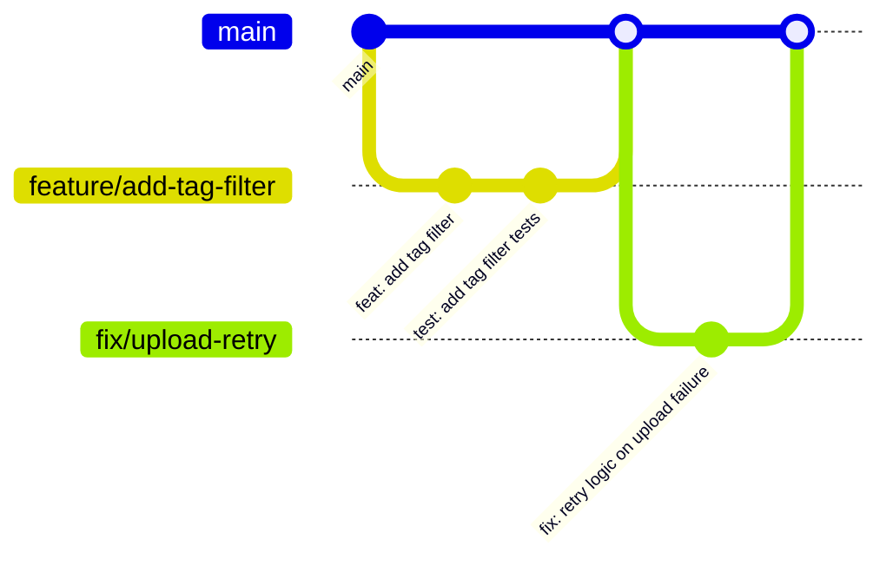

# Contributing to The Hive

Thank you for contributing! This guide ensures consistency across the codebase.

---

## Table of Contents

- [Development Setup](#development-setup)
- [Git Workflow](#git-workflow)
- [Branch Naming](#branch-naming)
- [Commit Messages](#commit-messages)
- [Code Style](#code-style)
- [Pull Request Process](#pull-request-process)
- [Adding a New API Endpoint](#adding-a-new-api-endpoint)
- [Adding a Database Migration](#adding-a-database-migration)
- [Testing Requirements](#testing-requirements)

---

## Development Setup

1. Fork and clone the repository
2. Install dependencies:
   ```bash
   cd server && npm install
   cd ../client && npm install
   ```
3. Copy environment files:
   ```bash
   cp server/.env.example server/.env
   ```
4. Start PostgreSQL and run migrations:
   ```bash
   cd server && npm run db:migrate && npm run db:seed
   ```
5. Start dev servers:
   ```bash
   # Terminal 1
   cd server && npm run dev
   # Terminal 2
   cd client && npm run dev
   ```

---

## Git Workflow

We use a **trunk-based development** model with short-lived feature branches:



1. Create a feature branch from `main`
2. Make your changes in small, focused commits
3. Open a Pull Request against `main`
4. After review and CI passes, squash-merge into `main`

---

## Branch Naming

Use this format: `<type>/<short-description>`

| Type | Use Case | Example |
|------|----------|---------|
| `feature/` | New feature | `feature/expense-filters` |
| `fix/` | Bug fix | `fix/ocr-amount-parsing` |
| `refactor/` | Code refactoring | `refactor/auth-middleware` |
| `docs/` | Documentation only | `docs/api-endpoint-guide` |
| `test/` | Adding tests | `test/workspace-isolation` |
| `chore/` | Build, CI, dependencies | `chore/update-dependencies` |

**Rules:**
- Use lowercase with hyphens (not underscores)
- Keep descriptions short (2–4 words)
- Delete branches after merging

---

## Commit Messages

Follow the [Conventional Commits](https://www.conventionalcommits.org/) specification:

```
<type>(<scope>): <short description>

<optional body>

<optional footer>
```

### Types

| Type | Description |
|------|-------------|
| `feat` | New feature |
| `fix` | Bug fix |
| `docs` | Documentation change |
| `style` | Formatting, whitespace (no code logic change) |
| `refactor` | Code restructuring (no behavior change) |
| `test` | Adding or updating tests |
| `chore` | Build process, dependencies, tooling |
| `perf` | Performance improvement |
| `security` | Security fix or improvement |

### Scopes

| Scope | Covers |
|-------|--------|
| `auth` | Authentication, login, registration, tokens |
| `workspace` | Workspace CRUD, members, invitations |
| `expense` | Expense CRUD, status transitions |
| `receipt` | File upload, OCR |
| `summary` | Reimbursement summary generation |
| `db` | Database migrations, schema |
| `api` | General API changes |
| `ui` | Frontend components, pages |

### Examples

```
feat(expense): add tag filtering to expense list

fix(receipt): handle OCR timeout for large PDF files

docs(api): add rate limit documentation to API reference

security(auth): add brute force protection to login endpoint

refactor(workspace): extract membership check to middleware

test(expense): add status transition edge case tests
```

---

## Code Style

### JavaScript / Node.js (Backend)

- **ESLint** with `eslint:recommended` + `eslint-plugin-node`
- **Prettier** for formatting (configured in `.prettierrc`)
- Semicolons: **required**
- Quotes: **single quotes**
- Indentation: **2 spaces**
- Trailing commas: **ES5** (arrays, objects)
- Max line length: **100 characters**
- Use `async/await` — never raw `.then()` chains
- Use `const` by default, `let` when reassignment needed, never `var`

### React (Frontend)

- **Functional components** with hooks — no class components
- **Named exports** for components
- Component files: `PascalCase.jsx` (e.g., `ExpenseCard.jsx`)
- Hook files: `camelCase.js` (e.g., `useAuth.js`)
- Utility files: `camelCase.js` (e.g., `formatCurrency.js`)
- CSS: Module files `ComponentName.module.css` or co-located `ComponentName.css`
- Props destructured in the function signature

### SQL

- Keywords in **UPPERCASE** (`SELECT`, `FROM`, `WHERE`)
- Table names in **snake_case**, plural (`expenses`, `workspace_members`)
- Column names in **snake_case** (`created_by_user_id`)
- Always use **parameterized queries** (`$1, $2, ...`)

### File & Folder Naming

| Location | Convention | Example |
|----------|-----------|---------|
| React components | PascalCase | `ExpenseCard.jsx` |
| React pages | PascalCase | `Dashboard.jsx` |
| Hooks | camelCase with `use` prefix | `useWorkspaces.js` |
| Services | camelCase | `expenseService.js` |
| Backend routes | camelCase | `expenseRoutes.js` |
| Backend controllers | camelCase | `expenseController.js` |
| Middleware | camelCase | `authMiddleware.js` |
| Migrations | numbered prefix | `001_create_users.sql` |
| Tests | `.test.js` suffix | `expenseController.test.js` |

### Linting & Formatting

```bash
# Run linter
npm run lint

# Fix auto-fixable issues
npm run lint:fix

# Format code
npm run format
```

**CI will fail if linting errors exist.** Fix all lint errors before opening a PR.

---

## Pull Request Process

### Before Opening a PR

- [ ] Code lints cleanly (`npm run lint`)
- [ ] All existing tests pass (`npm test`)
- [ ] New code has tests (see [Testing Requirements](#testing-requirements))
- [ ] Database migrations are reversible (include DOWN migration)
- [ ] No hardcoded secrets or credentials
- [ ] Environment variables documented in `.env.example` if new ones added
- [ ] PR description explains **what** and **why**

### PR Template

```markdown
## What does this PR do?
Brief description of the change.

## Why is this change needed?
Link to issue or explain the motivation.

## How was this tested?
- [ ] Unit tests added/updated
- [ ] Integration tests added/updated
- [ ] Manual testing (describe steps)

## Screenshots (if UI change)
Before / After screenshots.

## Checklist
- [ ] Lint passes
- [ ] Tests pass
- [ ] Migrations reversible
- [ ] No secrets committed
- [ ] Documentation updated (if applicable)
```

### Review Process

1. At least **1 approval** required to merge
2. All CI checks must pass
3. Reviewer checks for: correctness, security, test coverage, code style
4. Use **squash merge** to keep `main` history clean

---

## Adding a New API Endpoint

Follow these steps sequentially:

### 1. Database (if needed)
- Create a migration in `server/src/db/migrations/`
- Update `docs/DATABASE.md`

### 2. Model
- Add query functions in `server/src/models/<resource>Model.js`
- Use parameterized queries only

### 3. Controller
- Add business logic in `server/src/controllers/<resource>Controller.js`
- Handle errors with `AppError` class

### 4. Validation
- Add validation schema in `server/src/middleware/validators/<resource>Validator.js`
- Use `express-validator`

### 5. Route
- Register route in `server/src/routes/<resource>Routes.js`
- Apply middleware: `auth → validate → controller`

### 6. Tests
- Unit test the controller
- Integration test the full route (HTTP → DB)

### 7. Documentation
- Update `docs/API.md` with the new endpoint

### Example Route Registration

```javascript
// server/src/routes/expenseRoutes.js
const { Router } = require('express');
const { authenticate } = require('../middleware/authMiddleware');
const { verifyWorkspaceMember } = require('../middleware/workspaceMiddleware');
const { validateCreateExpense } = require('../middleware/validators/expenseValidator');
const { createExpense } = require('../controllers/expenseController');

const router = Router();

router.post(
  '/',
  authenticate,            // 1. Verify JWT
  validateCreateExpense,   // 2. Validate input
  verifyWorkspaceMember,   // 3. Check membership
  createExpense            // 4. Business logic
);

module.exports = router;
```

---

## Adding a Database Migration

### 1. Create the Migration File

```bash
# Naming: XXX_description.sql
# Example: 007_add_expense_category.sql
```

### 2. Write UP and DOWN

```sql
-- UP
ALTER TABLE expenses ADD COLUMN category VARCHAR(50);

-- DOWN
ALTER TABLE expenses DROP COLUMN category;
```

### 3. Test Locally

```bash
# Apply migration
npm run db:migrate

# Verify the change
npm run db:status

# Rollback to test the DOWN
npm run db:rollback

# Re-apply
npm run db:migrate
```

### 4. Rules

- **Never edit** a migration that has been applied to staging or production
- **One concern** per migration file
- **Always** include a DOWN migration
- **Test** both UP and DOWN before committing

---

## Testing Requirements

| Change Type | Required Tests |
|-------------|---------------|
| New API endpoint | Unit test (controller) + Integration test (route) |
| Bug fix | Regression test that reproduces the bug |
| Business logic change | Unit test for the updated logic |
| New UI component | Component test (render + interactions) |
| Database migration | Manual test of UP + DOWN |
| Security fix | Test that verifies the vulnerability is mitigated |

**Minimum coverage target:** 80% for backend, 70% for frontend.

See [TESTING.md](docs/TESTING.md) for full testing strategy.
