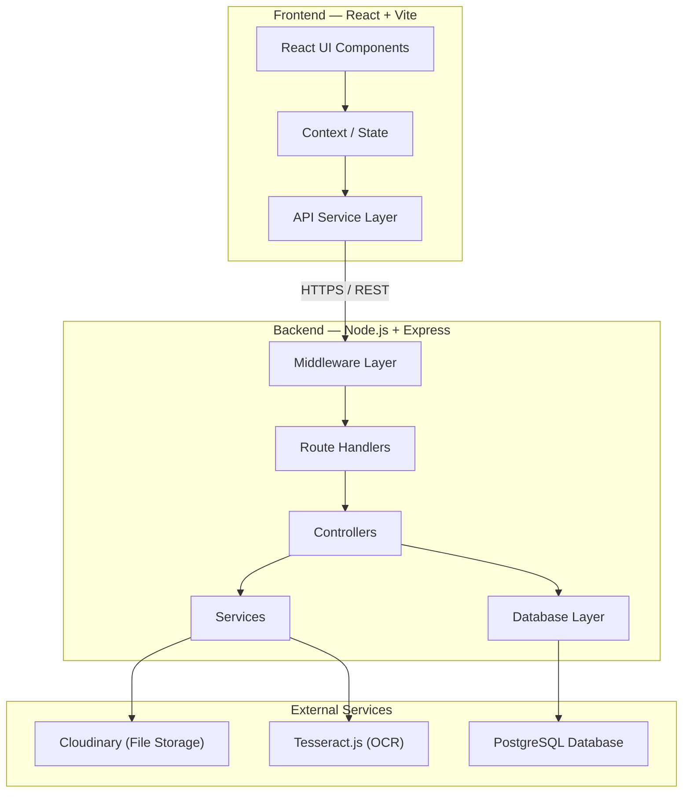
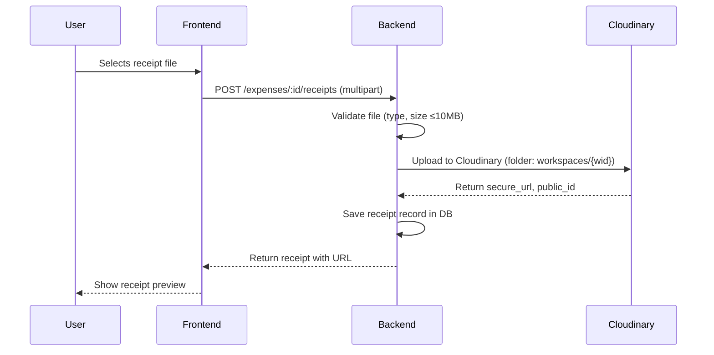
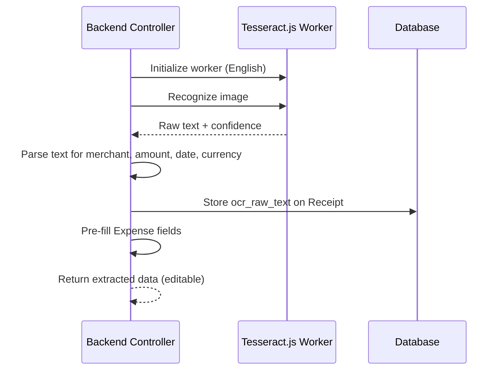
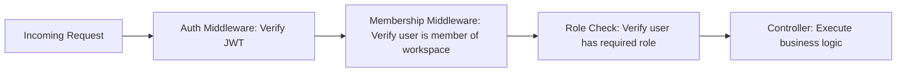
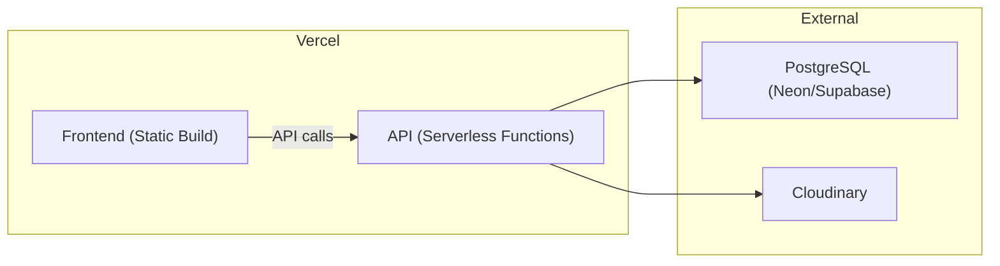

# Architecture — The Hive

This document describes the system architecture, design decisions, and integration patterns for The Hive.

---

## High-Level System Diagram



---

## Architecture Pattern

The application follows a **layered architecture** with clear separation of concerns:

```
Request → Middleware → Route → Controller → Service/Model → Response
```

### Layer Responsibilities

| Layer | Location | Responsibility |
|-------|----------|---------------|
| **Middleware** | `server/src/middleware/` | Auth verification, input validation, rate limiting, error handling, CORS |
| **Routes** | `server/src/routes/` | HTTP method + path mapping, request parsing, response formatting |
| **Controllers** | `server/src/controllers/` | Business logic orchestration, status transitions, authorization checks |
| **Services** | `server/src/services/` | External integrations (Cloudinary, Tesseract.js, email) |
| **Models** | `server/src/models/` | Database queries, data access, query building |

---

## Frontend Architecture

### State Management

- **React Context + useReducer** for global state (auth, active workspace)
- **Component-level state** for UI concerns (modals, form inputs)
- No external state library (Redux, Zustand) — unnecessary for MVP scope

### Routing

- **React Router v6** for client-side routing
- Protected routes via `<AuthGuard>` wrapper component
- Route structure mirrors the MVP screens:

```
/login
/signup
/forgot-password
/dashboard
/workspaces/:id
/workspaces/:id/expenses/:expenseId
/workspaces/:id/summary
```

### API Communication

- Centralized API service layer (`client/src/services/api.js`)
- Axios instance with interceptors for:
  - Attaching JWT access token to every request
  - Automatic token refresh on 401
  - Global error handling
- Each domain has its own service module:
  - `authService.js` — signup, login, refresh, password reset
  - `workspaceService.js` — CRUD, invite, members
  - `expenseService.js` — CRUD, status transitions, tags
  - `receiptService.js` — upload, OCR results
  - `summaryService.js` — generate, export

---

## Backend Architecture

### Authentication Strategy

- **JWT-based** with access + refresh token pair
- Access token: short-lived (15 minutes), stored in memory on frontend
- Refresh token: long-lived (7 days), stored in HTTP-only secure cookie
- Password hashing: **bcrypt** with cost factor 12
- See [SECURITY.md](SECURITY.md) for full details

### Request Validation

- **express-validator** for input sanitization and validation
- Validation schemas co-located with route definitions
- All validation errors return a consistent format:

```json
{
  "success": false,
  "error": {
    "code": "VALIDATION_ERROR",
    "message": "Validation failed",
    "details": [
      { "field": "amount", "message": "Amount must be a positive number" }
    ]
  }
}
```

### Error Handling

- Global error handler middleware as the last Express middleware
- Custom `AppError` class with HTTP status code, error code, and message
- All errors follow a consistent JSON response shape
- Unhandled rejections and uncaught exceptions are caught and logged

---

## Database Architecture

### ORM / Query Builder

- **No ORM** — raw SQL via the `pg` (node-postgres) driver with parameterized queries
- Connection pooling via `pg.Pool` (max 20 connections for production)
- All queries use parameterized statements (`$1, $2, ...`) to prevent SQL injection

### Migration Strategy

- SQL-based migrations in `server/src/db/migrations/`
- Naming: `001_create_users.sql`, `002_create_workspaces.sql`, etc.
- Up/down migration support
- See [DATABASE.md](DATABASE.md) for full schema

---

## File Storage Architecture

### Cloudinary Integration



**Key decisions:**
- Files uploaded to backend first, then forwarded to Cloudinary (not direct browser upload) — this ensures access control validation happens server-side
- Cloudinary folder structure: `the-hive/workspaces/{workspace_id}/receipts/`
- Accepted formats: JPG, PNG, PDF
- Max file size: **10 MB** per receipt
- Cloudinary transformations used for thumbnails (150×150) in list views
- **No signed URLs needed** — Cloudinary provides access control via folder-level restrictions and private delivery type

### Free Tier Limits (Cloudinary)

| Resource | Free Tier Limit |
|----------|----------------|
| Storage | 25 credits/month |
| Bandwidth | Included in credits |
| Transformations | Included in credits |

> 1 credit ≈ 1 GB storage **or** 1 GB bandwidth **or** 500 transformations

---

## OCR Architecture

### Tesseract.js Integration



**Key decisions:**
- Tesseract.js worker is initialized once and reused across requests (worker pool)
- Language: English (`eng`) — additional languages can be added
- Post-OCR parsing uses regex patterns to extract:
  - **Amount**: Looks for currency symbols followed by numbers (`$12.50`, `€100.00`)
  - **Date**: Looks for common date formats (`MM/DD/YYYY`, `DD-MM-YYYY`, `Month DD, YYYY`)
  - **Merchant**: First line of text or text near the top of the receipt
  - **Currency**: Inferred from currency symbol or defaults to workspace preference
- All extracted fields are returned as **suggestions** — the user always has final control
- If extraction fails for any field, it's returned as `null` and highlighted in the UI

---

## Workspace Isolation

Workspace isolation is a core security principle. Every data query is scoped to a workspace, and membership is verified before access.



- Every workspace-scoped endpoint runs through `verifyWorkspaceMembership` middleware
- Database queries always include `WHERE workspace_id = $1` — never fetch across workspaces
- Removing a member revokes access immediately (next request will fail membership check)

---

## Deployment Architecture



- Frontend: Deployed as static site on Vercel
- Backend: Deployed as Vercel Serverless Functions (`/api/*` routes)
- Database: Hosted PostgreSQL (Neon or Supabase free tier)
- File Storage: Cloudinary
- See [DEPLOYMENT.md](DEPLOYMENT.md) for full deployment guide

---

## Key Design Decisions

| Decision | Choice | Rationale |
|----------|--------|-----------|
| No ORM | `pg` driver directly | Simpler, fewer abstractions, full SQL control, better performance |
| JWT over sessions | JWT with refresh tokens | Stateless, scales with serverless (Vercel), no session store needed |
| Server-side upload | Backend proxies to Cloudinary | Ensures auth + validation before file reaches storage |
| Tesseract.js over cloud OCR | Local processing | Completely free, no API limits, no data leaves the server |
| React Context over Redux | Context + useReducer | Sufficient for MVP scope, less boilerplate, no extra dependency |
| SQL migrations over ORM migrations | Raw SQL files | Full control, database-agnostic, easier to review |
