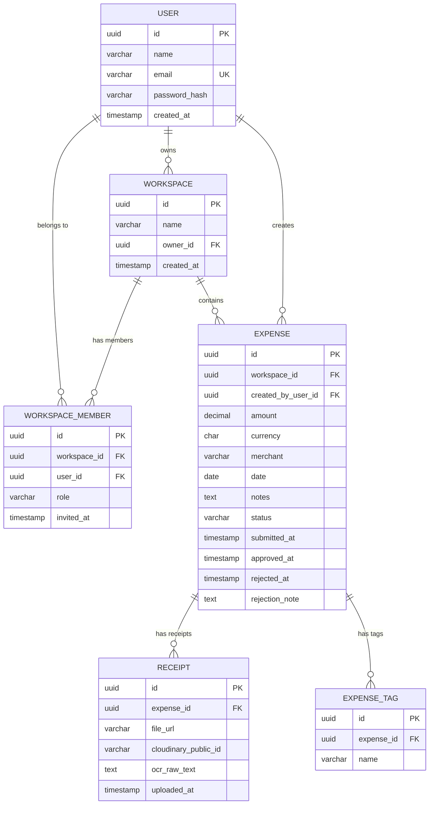
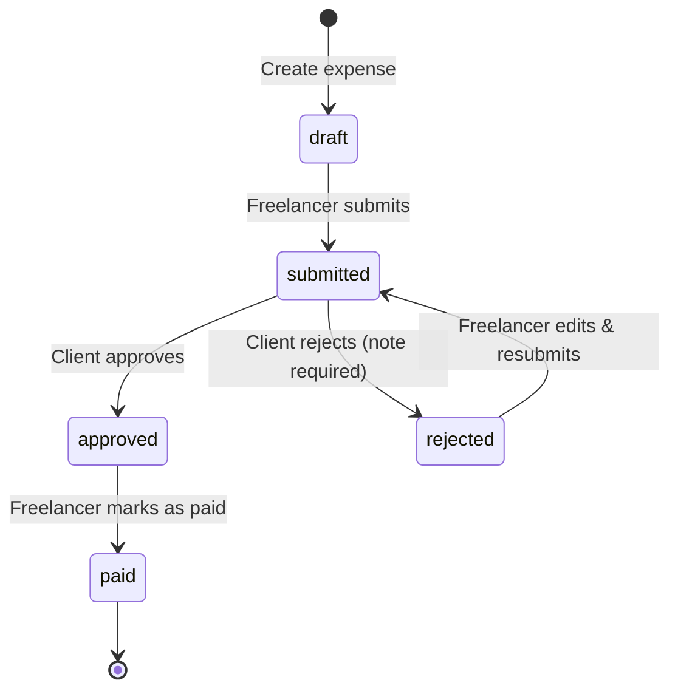

# Database Schema — The Hive

This document is the single source of truth for the database schema, relationships, indexes, validation rules, and migration strategy.

**Database:** PostgreSQL 15+

---

## Entity-Relationship Diagram



---

## Table Definitions

### 1. `users`

Stores registered user accounts.

```sql
CREATE TABLE users (
    id              UUID PRIMARY KEY DEFAULT gen_random_uuid(),
    name            VARCHAR(255) NOT NULL,
    email           VARCHAR(255) UNIQUE NOT NULL,
    password_hash   VARCHAR(255) NOT NULL,
    created_at      TIMESTAMP NOT NULL DEFAULT CURRENT_TIMESTAMP
);

CREATE INDEX idx_users_email ON users (email);
```

| Column | Type | Constraints | Notes |
|--------|------|-------------|-------|
| `id` | UUID | PK, auto-generated | `gen_random_uuid()` |
| `name` | VARCHAR(255) | NOT NULL | Display name |
| `email` | VARCHAR(255) | UNIQUE, NOT NULL | Login identifier |
| `password_hash` | VARCHAR(255) | NOT NULL | bcrypt hash, cost 12 |
| `created_at` | TIMESTAMP | NOT NULL, default now | Registration time |

---

### 2. `workspaces`

A workspace groups expenses and members together.

```sql
CREATE TABLE workspaces (
    id              UUID PRIMARY KEY DEFAULT gen_random_uuid(),
    name            VARCHAR(100) NOT NULL,
    owner_id        UUID NOT NULL REFERENCES users(id) ON DELETE RESTRICT,
    created_at      TIMESTAMP NOT NULL DEFAULT CURRENT_TIMESTAMP,

    CONSTRAINT chk_workspace_name_length CHECK (char_length(name) BETWEEN 1 AND 100)
);

CREATE INDEX idx_workspaces_owner ON workspaces (owner_id);
```

| Column | Type | Constraints | Notes |
|--------|------|-------------|-------|
| `id` | UUID | PK | |
| `name` | VARCHAR(100) | NOT NULL, 1–100 chars | Workspace display name |
| `owner_id` | UUID | FK → users(id), NOT NULL | Creator of the workspace |
| `created_at` | TIMESTAMP | NOT NULL, default now | |

---

### 3. `workspace_members`

Maps users to workspaces with their assigned role.

```sql
CREATE TABLE workspace_members (
    id              UUID PRIMARY KEY DEFAULT gen_random_uuid(),
    workspace_id    UUID NOT NULL REFERENCES workspaces(id) ON DELETE CASCADE,
    user_id         UUID NOT NULL REFERENCES users(id) ON DELETE CASCADE,
    role            VARCHAR(20) NOT NULL,
    invited_at      TIMESTAMP NOT NULL DEFAULT CURRENT_TIMESTAMP,

    CONSTRAINT uq_workspace_user UNIQUE (workspace_id, user_id),
    CONSTRAINT chk_member_role CHECK (role IN ('freelancer', 'client'))
);

CREATE INDEX idx_members_workspace ON workspace_members (workspace_id);
CREATE INDEX idx_members_user ON workspace_members (user_id);
```

| Column | Type | Constraints | Notes |
|--------|------|-------------|-------|
| `id` | UUID | PK | |
| `workspace_id` | UUID | FK → workspaces(id), NOT NULL | CASCADE on workspace delete |
| `user_id` | UUID | FK → users(id), NOT NULL | CASCADE on user delete |
| `role` | VARCHAR(20) | NOT NULL, CHECK IN ('freelancer','client') | Determines permissions |
| `invited_at` | TIMESTAMP | NOT NULL, default now | When user was added |

**Unique constraint:** One membership per user per workspace.

---

### 4. `expenses`

The central entity — an expense linked to a workspace and a creator.

```sql
CREATE TABLE expenses (
    id                  UUID PRIMARY KEY DEFAULT gen_random_uuid(),
    workspace_id        UUID NOT NULL REFERENCES workspaces(id) ON DELETE CASCADE,
    created_by_user_id  UUID NOT NULL REFERENCES users(id) ON DELETE RESTRICT,
    amount              DECIMAL(10,2) NOT NULL,
    currency            CHAR(3) NOT NULL,
    merchant            VARCHAR(255) NOT NULL,
    date                DATE NOT NULL,
    notes               TEXT,
    status              VARCHAR(20) NOT NULL DEFAULT 'draft',
    submitted_at        TIMESTAMP,
    approved_at         TIMESTAMP,
    rejected_at         TIMESTAMP,
    rejection_note      TEXT,
    created_at          TIMESTAMP NOT NULL DEFAULT CURRENT_TIMESTAMP,
    updated_at          TIMESTAMP NOT NULL DEFAULT CURRENT_TIMESTAMP,

    CONSTRAINT chk_amount_positive CHECK (amount > 0),
    CONSTRAINT chk_currency_format CHECK (currency ~ '^[A-Z]{3}$'),
    CONSTRAINT chk_expense_status CHECK (status IN ('draft', 'submitted', 'approved', 'rejected', 'paid'))
);

CREATE INDEX idx_expense_workspace_status ON expenses (workspace_id, status);
CREATE INDEX idx_expense_submitted_at ON expenses (submitted_at);
CREATE INDEX idx_expense_created_by ON expenses (created_by_user_id);
CREATE INDEX idx_expense_date ON expenses (date);

-- Auto-update updated_at on row change
CREATE OR REPLACE FUNCTION update_updated_at_column()
RETURNS TRIGGER AS $$
BEGIN
    NEW.updated_at = CURRENT_TIMESTAMP;
    RETURN NEW;
END;
$$ LANGUAGE plpgsql;

CREATE TRIGGER trg_expenses_updated_at
    BEFORE UPDATE ON expenses
    FOR EACH ROW
    EXECUTE FUNCTION update_updated_at_column();
```

| Column | Type | Constraints | Notes |
|--------|------|-------------|-------|
| `id` | UUID | PK | |
| `workspace_id` | UUID | FK → workspaces(id), NOT NULL | CASCADE on workspace delete |
| `created_by_user_id` | UUID | FK → users(id), NOT NULL | RESTRICT on user delete |
| `amount` | DECIMAL(10,2) | NOT NULL, > 0 | Max 99,999,999.99 |
| `currency` | CHAR(3) | NOT NULL, regex `^[A-Z]{3}$` | ISO 4217 code |
| `merchant` | VARCHAR(255) | NOT NULL | Vendor/store name |
| `date` | DATE | NOT NULL | Expense date |
| `notes` | TEXT | nullable | Optional description |
| `status` | VARCHAR(20) | NOT NULL, default 'draft' | See state machine below |
| `submitted_at` | TIMESTAMP | nullable | Set when submitted |
| `approved_at` | TIMESTAMP | nullable | Set when approved |
| `rejected_at` | TIMESTAMP | nullable | Set when rejected |
| `rejection_note` | TEXT | nullable | Required on rejection |
| `created_at` | TIMESTAMP | NOT NULL, default now | |
| `updated_at` | TIMESTAMP | NOT NULL, default now | Auto-updated by trigger |

---

### 5. `receipts`

File references and OCR data for receipt images attached to an expense.

```sql
CREATE TABLE receipts (
    id                      UUID PRIMARY KEY DEFAULT gen_random_uuid(),
    expense_id              UUID NOT NULL REFERENCES expenses(id) ON DELETE CASCADE,
    file_url                VARCHAR(1000) NOT NULL,
    cloudinary_public_id    VARCHAR(500),
    original_filename       VARCHAR(255),
    file_hash               VARCHAR(64),
    file_size_bytes         INTEGER,
    mime_type               VARCHAR(50),
    ocr_raw_text            TEXT,
    uploaded_at             TIMESTAMP NOT NULL DEFAULT CURRENT_TIMESTAMP
);

CREATE INDEX idx_receipt_expense ON receipts (expense_id);
CREATE INDEX idx_receipt_file_hash ON receipts (file_hash);
```

| Column | Type | Constraints | Notes |
|--------|------|-------------|-------|
| `id` | UUID | PK | |
| `expense_id` | UUID | FK → expenses(id), NOT NULL | CASCADE on expense delete |
| `file_url` | VARCHAR(1000) | NOT NULL | Cloudinary secure URL |
| `cloudinary_public_id` | VARCHAR(500) | nullable | For Cloudinary management |
| `original_filename` | VARCHAR(255) | nullable | Original uploaded filename |
| `file_hash` | VARCHAR(64) | nullable | SHA-256 hash for dedup |
| `file_size_bytes` | INTEGER | nullable | File size tracking |
| `mime_type` | VARCHAR(50) | nullable | `image/jpeg`, `image/png`, `application/pdf` |
| `ocr_raw_text` | TEXT | nullable | Raw OCR output |
| `uploaded_at` | TIMESTAMP | NOT NULL, default now | |

---

### 6. `expense_tags`

Free-text tags attached to expenses.

```sql
CREATE TABLE expense_tags (
    id          UUID PRIMARY KEY DEFAULT gen_random_uuid(),
    expense_id  UUID NOT NULL REFERENCES expenses(id) ON DELETE CASCADE,
    name        VARCHAR(100) NOT NULL,

    CONSTRAINT uq_expense_tag UNIQUE (expense_id, name),
    CONSTRAINT chk_tag_name_length CHECK (char_length(TRIM(name)) BETWEEN 1 AND 50)
);

CREATE INDEX idx_tag_expense ON expense_tags (expense_id);
CREATE INDEX idx_tag_name ON expense_tags (name);
```

| Column | Type | Constraints | Notes |
|--------|------|-------------|-------|
| `id` | UUID | PK | |
| `expense_id` | UUID | FK → expenses(id), NOT NULL | CASCADE on expense delete |
| `name` | VARCHAR(100) | NOT NULL, unique per expense | Trimmed, 1–50 chars |

**Predefined tag suggestions** (not enforced in DB — enforced in UI):
`Travel`, `Ads`, `Software`, `Office Supplies`

---

## Expense Status State Machine



### Transition Rules

| From | To | Who | Requirements |
|------|----|-----|-------------|
| — | `draft` | Freelancer | Expense created |
| `draft` | `submitted` | Freelancer | All required fields filled |
| `submitted` | `approved` | Client | Optional note |
| `submitted` | `rejected` | Client | **Rejection note required** |
| `rejected` | `submitted` | Freelancer | Must edit expense first |
| `approved` | `paid` | Freelancer | Optional (for tracking) |

**Invalid transitions** (enforced server-side):
- `draft` → `approved` ❌
- `approved` → `rejected` ❌
- `paid` → any ❌
- `rejected` → `approved` ❌ (must resubmit first)

---

## Data Validation Rules (Backend Enforcement)

| Field | Rule |
|-------|------|
| `amount` | Positive number, max 2 decimal places, max `99999999.99` |
| `currency` | ISO 4217 three-letter code (uppercase), validated against known list |
| `date` | Cannot be in the future for `submitted` expenses; any date allowed for `draft` |
| `status` | Only valid transitions allowed (see state machine) |
| `rejection_note` | **Required** when transitioning to `rejected`; min 1 character |
| `workspace.name` | 1–100 characters |
| `tag.name` | 1–50 characters, no leading/trailing whitespace |
| `user.email` | Valid email format, unique |
| `user.password` | Minimum 8 characters |

---

## Migration Strategy

### File Naming Convention

```
server/src/db/migrations/
├── 001_create_users.sql
├── 002_create_workspaces.sql
├── 003_create_workspace_members.sql
├── 004_create_expenses.sql
├── 005_create_receipts.sql
├── 006_create_expense_tags.sql
└── 007_create_updated_at_trigger.sql
```

### Migration Commands

```bash
# Run all pending migrations
npm run db:migrate

# Rollback last migration
npm run db:rollback

# Reset database (drop all + re-migrate)
npm run db:reset

# Check migration status
npm run db:status
```

### Rules

1. **Migrations are immutable** — never edit a migration after it has been applied to any environment
2. **Always include a rollback** — every `UP` migration must have a corresponding `DOWN`
3. **One concern per migration** — don't mix table creation with data seeding
4. **Test migrations** against a fresh database before merging

---

## Seed Data

For development and demo purposes, the seeder creates:

- 2 users: `freelancer@demo.com` / `client@demo.com` (password: `DemoPass123!`)
- 1 workspace: "Demo Project"
- 5 sample expenses in various statuses
- Sample tags attached to expenses

```bash
npm run db:seed
```
