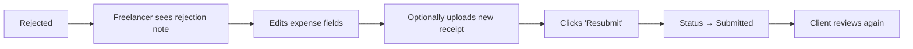

# Edge Cases — The Hive

This document catalogs every edge case that must be handled, specifying the expected behavior, which layer handles it, and the associated test case.

---

## EC-1: Duplicate Receipt Upload

**Scenario:** A user uploads the same file twice to the same expense.

**Detection:** SHA-256 hash of file contents is computed on upload and compared against existing receipts for the same expense.

| Aspect | Detail |
|--------|--------|
| **Layer** | Backend (controller + model) |
| **Behavior** | If hash matches an existing receipt on the same expense, return `409 DUPLICATE_RECEIPT` with a warning message. Do **not** silently save the duplicate. |
| **User Experience** | Frontend shows: "This receipt has already been uploaded to this expense." with option to dismiss. |
| **Cross-Expense** | Same file uploaded to **different** expenses is allowed (intentional — same receipt may apply to different contexts). |
| **Test Case** | Upload file A → success. Upload file A again to same expense → 409. Upload file A to different expense → 201. |

```javascript
// Backend check
const existingReceipt = await db.query(
  'SELECT id FROM receipts WHERE expense_id = $1 AND file_hash = $2',
  [expenseId, fileHash]
);
if (existingReceipt.rows.length > 0) {
  throw new AppError(409, 'DUPLICATE_RECEIPT', 'This receipt has already been uploaded.');
}
```

---

## EC-2: Upload Failure / Network Error

**Scenario:** File upload to Cloudinary fails due to network issues, timeout, or Cloudinary downtime.

| Aspect | Detail |
|--------|--------|
| **Layer** | Backend (service) + Frontend (UI) |
| **Backend Behavior** | Catch Cloudinary upload errors. Return `502 BAD_GATEWAY` with message: "File upload failed. Please try again." Do **not** create a receipt record in the database. |
| **Frontend Behavior** | Preserve all form data (amount, merchant, date, notes, tags). Show retry button on the failed file only. Do not clear the form. |
| **Timeout** | Set Cloudinary upload timeout to 30 seconds (matches Vercel serverless limit). |
| **Partial Batch** | If uploading 3 files and file 2 fails: save files 1 (success), return error for file 2, still attempt file 3. Return partial success response listing which succeeded and which failed. |
| **Test Case** | Mock Cloudinary to throw error → verify no receipt record created in DB, verify 502 response, verify form data preserved on frontend. |

```javascript
// Partial batch upload handling
const results = await Promise.allSettled(
  files.map(file => cloudinaryService.upload(file))
);

const succeeded = results.filter(r => r.status === 'fulfilled');
const failed = results.filter(r => r.status === 'rejected');

// Save succeeded receipts to DB
// Return both succeeded and failed in response
```

---

## EC-3: OCR Partial Extraction

**Scenario:** Tesseract.js extracts some fields but not all (e.g., amount found but merchant missing).

| Aspect | Detail |
|--------|--------|
| **Layer** | Backend (OCR service) + Frontend (UI) |
| **Backend Behavior** | Return all extracted fields. Fields that couldn't be extracted are returned as `null`. Include a `confidence` score (0–1) for each field. |
| **Frontend Behavior** | Auto-fill fields that were extracted. Fields returned as `null` should be highlighted with a yellow border and helper text: "Could not be extracted — please fill in manually." |
| **Total OCR Failure** | If no fields were extracted at all: all fields are `null`, OCR raw text still saved. Show message: "We couldn't read this receipt. Please enter the details manually." |
| **Confidence Threshold** | Fields with confidence < 0.5 should be flagged with a ⚠️ icon: "Low confidence — please verify." |
| **Test Case** | Upload blurry receipt → verify partial fields returned, verify null fields highlighted on frontend. |

```javascript
// OCR response shape
{
  "ocr_extracted": {
    "merchant": { "value": "Office Depot", "confidence": 0.92 },
    "amount": { "value": 42.50, "confidence": 0.88 },
    "date": { "value": null, "confidence": 0 },       // ← Could not extract
    "currency": { "value": "USD", "confidence": 0.75 }
  }
}
```

---

## EC-4: Rejected Expense Resubmission

**Scenario:** A freelancer's expense is rejected by a client. The freelancer edits it and resubmits.

| Aspect | Detail |
|--------|--------|
| **Layer** | Backend (controller) + Frontend (UI) |
| **Behavior** | When an expense is in `rejected` status, the freelancer can: edit fields (`PATCH /expenses/:id`), upload new receipts, remove old receipts, then resubmit (`POST /expenses/:id/submit`). |
| **Rejection Note Visibility** | The rejection note and rejected_at timestamp **must remain visible** even after resubmission. Previous rejection history is preserved. |
| **Status Transitions** | `rejected` → (user edits) → `submitted`. The user cannot go directly to `submitted` without making at least one change (edit a field or upload a new receipt). |
| **Test Case** | Create expense → submit → reject with note → verify note visible → edit amount → resubmit → verify status is `submitted`, previous rejection note still accessible. |



---

## EC-5: Removing a Workspace Member

**Scenario:** A workspace owner removes a member (freelancer or client) from the workspace.

| Aspect | Detail |
|--------|--------|
| **Layer** | Backend (controller + middleware) |
| **Immediate Effect** | The `workspace_members` record is deleted. On the removed user's **next request**, the `verifyWorkspaceMember` middleware will fail with `403 FORBIDDEN`. |
| **Existing Expenses** | Expenses created by the removed member **remain** in the workspace. They are **read-only** for other members (cannot be edited or deleted by others). The `created_by_user_id` still references the removed user. |
| **Removed User's View** | The workspace no longer appears in their `GET /workspaces` response. Direct access via URL returns `403`. |
| **Edge Within Edge** | If the removed user had expenses in `submitted` status, they remain as-is. The client can still approve/reject them. |
| **Cannot Self-Remove** | The workspace owner cannot remove themselves. Error: `400 CANNOT_REMOVE_SELF`. |
| **Cannot Remove Owner** | No one can remove the workspace owner. If ownership transfer is needed, it's out of scope for MVP. |
| **Test Case** | Add member → verify access → remove member → verify 403 on next request → verify their expenses still visible to other members. |

---

## EC-6: Empty Tag List

**Scenario:** An expense is created or submitted with zero tags.

| Aspect | Detail |
|--------|--------|
| **Layer** | Backend (validation) + Frontend (UI) |
| **Behavior** | Tags are **entirely optional**. An expense can be created, submitted, approved, and paid with zero tags. No validation error should occur for missing tags. |
| **Frontend** | Tag section shows "No tags" or "Add a tag..." placeholder. Filter by tag shows all expenses when no tag is selected. |
| **Summary** | Summary generation works normally for untagged expenses. |
| **Test Case** | Create expense → submit without tags → approve → verify no errors at any step. |

---

## EC-7: Future Date on Expense

**Scenario:** User enters a future date on an expense.

| Aspect | Detail |
|--------|--------|
| **Layer** | Backend (validation) |
| **Draft Status** | Future dates **are allowed** for draft expenses (user might be pre-entering data). |
| **Submitted Status** | When submitting (`POST /expenses/:id/submit`), if the date is in the future, return `400 VALIDATION_ERROR`: "Expense date cannot be in the future for submitted expenses." |
| **Timezone Handling** | Date comparison uses **server date** (UTC). Consider a 24-hour grace period to handle timezone differences. |
| **Test Case** | Create draft with tomorrow's date → success. Submit that draft → 400 error. Change date to today → submit succeeds. |

---

## EC-8: Concurrent Approval/Rejection

**Scenario:** Two clients (both members of the workspace) try to approve and reject the same expense at nearly the same time.

| Aspect | Detail |
|--------|--------|
| **Layer** | Backend (database) |
| **Behavior** | Use optimistic concurrency control. The first request to complete wins. The second request finds the status is no longer `submitted` and returns `409 INVALID_STATUS`: "This expense has already been processed." |
| **Implementation** | Use `UPDATE ... WHERE status = 'submitted' RETURNING *` — if no rows returned, the status already changed. |
| **Test Case** | Two concurrent requests: one approve, one reject → only one succeeds, other gets 409. |

```javascript
// Atomic status transition
const result = await pool.query(
  `UPDATE expenses SET status = $1, approved_at = NOW()
   WHERE id = $2 AND status = 'submitted'
   RETURNING *`,
  ['approved', expenseId]
);
if (result.rowCount === 0) {
  throw new AppError(409, 'INVALID_STATUS', 'This expense has already been processed.');
}
```

---

## EC-9: Large File Upload

**Scenario:** User tries to upload a file larger than 10 MB.

| Aspect | Detail |
|--------|--------|
| **Layer** | Backend (middleware — multer) + Frontend (UI) |
| **Backend** | Multer `limits.fileSize` set to `10 * 1024 * 1024` (10 MB). If exceeded, return `413 FILE_TOO_LARGE`. |
| **Frontend** | Check file size before upload. If > 10 MB, show error immediately without making API call: "File is too large. Maximum size is 10 MB." |
| **Vercel Limit** | Vercel serverless functions have a **4.5 MB request body limit** by default. For larger files, use direct-to-Cloudinary upload with a signed upload URL, or increase the body limit via `vercel.json`. |
| **Test Case** | Upload 11 MB file → verify 413 response, no file saved. Upload 9.9 MB file → success. |

---

## EC-10: Invalid File Type (Disguised Extension)

**Scenario:** User renames a `.exe` file to `.jpg` and tries to upload it.

| Aspect | Detail |
|--------|--------|
| **Layer** | Backend (middleware) |
| **Behavior** | Validate file by reading **magic bytes** (file signature), not just the extension or Content-Type header. If magic bytes don't match JPEG, PNG, or PDF, return `415 UNSUPPORTED_FILE_TYPE`. |
| **Test Case** | Rename text file to `.jpg` → upload → verify 415 error based on magic byte check. |

---

## EC-11: Expense With No Receipts (Submit Attempt)

**Scenario:** User tries to submit an expense that has no receipts attached.

| Aspect | Detail |
|--------|--------|
| **Layer** | Backend (controller) |
| **Behavior** | On `POST /expenses/:id/submit`, check that at least one receipt exists. If none, return `400 VALIDATION_ERROR`: "At least one receipt is required to submit an expense." |
| **Draft** | Drafts can exist with zero receipts — the restriction only applies at submission time. |
| **Test Case** | Create expense (no receipt) → try submit → 400. Upload receipt → submit → 200. |

---

## EC-12: Deleted Receipt (Last Receipt on Submitted Expense)

**Scenario:** What if receipts could be deleted from a submitted expense?

| Aspect | Detail |
|--------|--------|
| **Layer** | Backend (controller) |
| **Behavior** | Receipt deletion is only allowed when expense status is `draft` or `rejected`. For `submitted`, `approved`, and `paid` statuses, receipt deletion returns `409 INVALID_STATUS`: "Cannot delete receipts from a submitted expense." |
| **Test Case** | Submit expense → try delete receipt → 409. |

---

## EC-13: Workspace With No Members (Owner Deletion Edge)

**Scenario:** What happens to a workspace if the owner is somehow removed?

| Aspect | Detail |
|--------|--------|
| **Layer** | Backend (controller) |
| **Behavior** | The owner **cannot be removed** from their own workspace. The `DELETE /workspaces/:id/members/:userId` endpoint checks if `userId === workspace.owner_id` and returns `400 CANNOT_REMOVE_OWNER`. |
| **Account Deletion** | If the owner deletes their account (future feature), the workspace is either deleted (cascade) or transferred. For MVP, owners cannot delete their account without first transferring ownership or deleting the workspace. |
| **Test Case** | Try to remove workspace owner → 400 error. |

---

## EC-14: Special Characters in Inputs

**Scenario:** User enters special characters in merchant name, notes, workspace name, or tag name.

| Aspect | Detail |
|--------|--------|
| **Layer** | Backend (validation + database) |
| **Allowed** | UTF-8 characters are allowed in merchant, notes, and workspace names. Tags allow alphanumeric + spaces + hyphens + common symbols. |
| **SQL Injection** | Parameterized queries prevent SQL injection regardless of input. |
| **XSS** | All text output is escaped by React's JSX rendering. `dangerouslySetInnerHTML` is never used. |
| **Test Case** | Create expense with merchant: `O'Reilly's "Books" & More <script>alert(1)</script>` → saves correctly, displays correctly, no XSS. |

---

## EC-15: Session Expiry During Form Fill

**Scenario:** User spends > 15 minutes filling out an expense form. Their access token expires.

| Aspect | Detail |
|--------|--------|
| **Layer** | Frontend (API service layer) |
| **Behavior** | When a 401 is received, the Axios interceptor automatically calls `POST /auth/refresh` to get a new access token, then **retries the original request**. The user never sees a login screen during normal usage. |
| **Refresh Token Also Expired** | If the refresh token is also expired (7 days old), redirect to login. All unsaved form data is lost. |
| **Mitigation** | Auto-save drafts to localStorage every 30 seconds. On login redirect, attempt to restore form data from localStorage. |
| **Test Case** | Mock expired token → make API call → verify refresh happens transparently → verify original request succeeds. |

---

## Summary Table

| ID | Edge Case | Severity | Layer |
|----|-----------|----------|-------|
| EC-1 | Duplicate receipt upload | Medium | Backend |
| EC-2 | Upload failure / network error | High | Backend + Frontend |
| EC-3 | OCR partial extraction | High | Backend + Frontend |
| EC-4 | Rejected expense resubmission | High | Backend + Frontend |
| EC-5 | Removing a workspace member | High | Backend |
| EC-6 | Empty tag list | Low | Backend + Frontend |
| EC-7 | Future date on expense | Medium | Backend |
| EC-8 | Concurrent approval/rejection | Medium | Backend (Database) |
| EC-9 | Large file upload | Medium | Backend + Frontend |
| EC-10 | Invalid file type (disguised) | High | Backend |
| EC-11 | Expense with no receipts (submit) | Medium | Backend |
| EC-12 | Delete receipt from submitted expense | Medium | Backend |
| EC-13 | Workspace owner removal | Low | Backend |
| EC-14 | Special characters in inputs | High | Backend + Frontend |
| EC-15 | Session expiry during form fill | Medium | Frontend |
