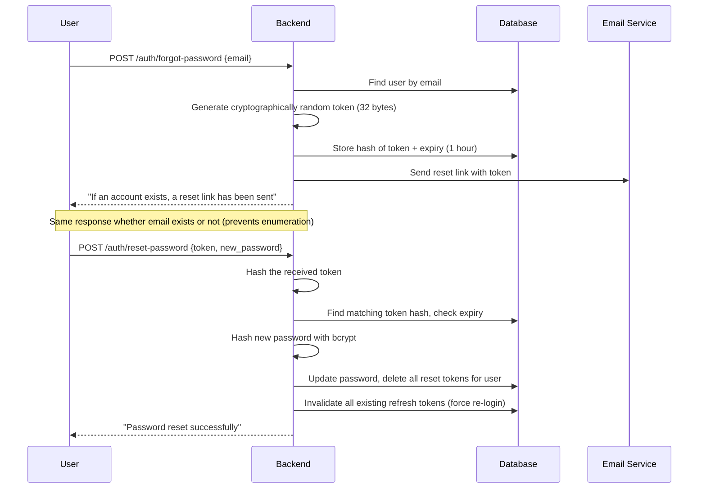
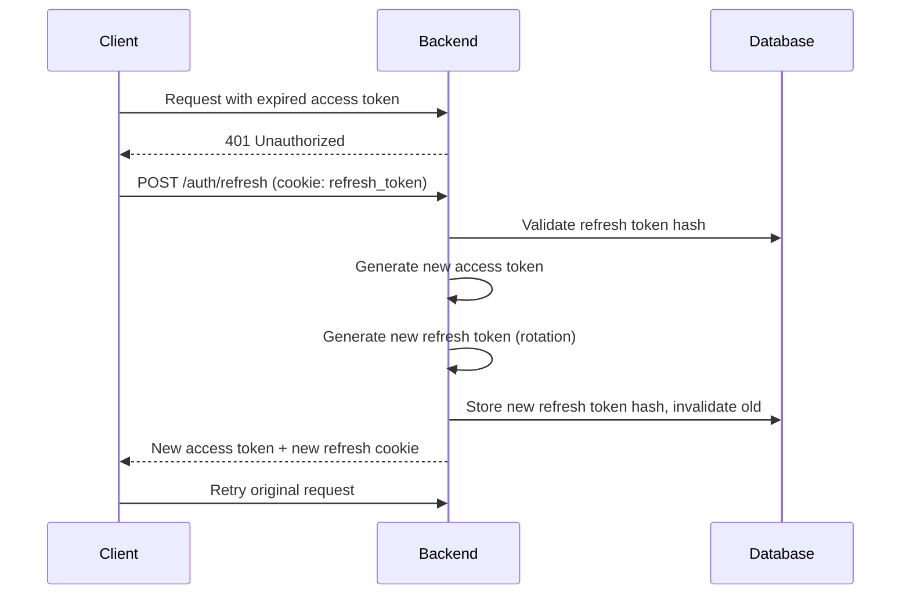

# Security Engineering Guide — The Hive

This document defines the security architecture, threat model, and implementation requirements for The Hive. Every control listed here is a **hard requirement** — not a suggestion.

> **Principle:** Security is not a feature. It is a property of the system that must be designed in from the first line of code.

---

## Table of Contents

1. [Security Principles](#1-security-principles)
2. [Threat Model](#2-threat-model)
3. [Authentication Security](#3-authentication-security)
4. [Authorization & Access Control](#4-authorization--access-control)
5. [Input Validation & Injection Prevention](#5-input-validation--injection-prevention)
6. [Cryptography](#6-cryptography)
7. [File Upload Security](#7-file-upload-security)
8. [Transport Security](#8-transport-security)
9. [Session & Token Management](#9-session--token-management)
10. [Rate Limiting & Abuse Prevention](#10-rate-limiting--abuse-prevention)
11. [Error Handling & Information Disclosure](#11-error-handling--information-disclosure)
12. [Logging & Audit Trail](#12-logging--audit-trail)
13. [Dependency Security](#13-dependency-security)
14. [HTTP Security Headers](#14-http-security-headers)
15. [Database Security](#15-database-security)
16. [CORS Policy](#16-cors-policy)
17. [Environment & Secrets Management](#17-environment--secrets-management)
18. [Data Privacy & Compliance](#18-data-privacy--compliance)
19. [Incident Response](#19-incident-response)
20. [Security Checklist](#20-security-checklist)

---

## 1. Security Principles

Every engineering decision must adhere to these foundational principles:

| Principle | Description |
|-----------|-------------|
| **Defense in Depth** | Multiple layers of security controls — never rely on a single check |
| **Least Privilege** | Every user, process, and component gets the minimum access necessary |
| **Fail Secure** | On error, deny access by default — never fail open |
| **Zero Trust** | Verify every request. Never trust the client, the network, or even internal services |
| **Separation of Concerns** | Auth logic, business logic, and data access are in separate layers |
| **Secure by Default** | Security controls are active by default; insecure options require explicit opt-in |
| **Don't Roll Your Own Crypto** | Use proven libraries (bcrypt, jsonwebtoken, crypto) — never custom algorithms |
| **Minimize Attack Surface** | Expose only necessary endpoints, fields, and functionality |

---

## 2. Threat Model

### Assets Under Protection

| Asset | Sensitivity | Impact if Compromised |
|-------|------------|----------------------|
| User credentials (passwords, tokens) | **Critical** | Account takeover, data breach |
| Receipt files (images, PDFs) | **High** | Financial data exposure, privacy violation |
| Expense data (amounts, merchants) | **High** | Financial intelligence leakage |
| User PII (name, email) | **High** | Identity theft, phishing |
| Workspace membership data | **Medium** | Unauthorized access to financial data |

### Threat Actors

| Actor | Motivation | Capability |
|-------|-----------|------------|
| **External attacker** | Data theft, financial fraud | Automated scanning, credential stuffing |
| **Malicious user** | Access other users' data, expense fraud | Authenticated access, parameter manipulation |
| **Compromised insider** | Data exfiltration | Legitimate credentials, internal knowledge |
| **Automated bot** | Account enumeration, brute force | High-volume requests |

### STRIDE Analysis

| Threat | Category | Mitigation |
|--------|----------|------------|
| User impersonation | **S**poofing | Strong auth, JWT validation, refresh token rotation |
| Data modification in transit | **T**ampering | HTTPS only, HMAC signatures where applicable |
| Claiming expense not yours | **R**epudiation | Audit logs with timestamps, `created_by_user_id` |
| Viewing expenses from other workspaces | **I**nformation Disclosure | Workspace isolation, membership verification on every query |
| Too many uploads crashing server | **D**enial of Service | Rate limiting, file size limits, upload quotas |
| Bypassing role checks | **E**levation of Privilege | Server-side role checks on every endpoint, never trust client role |

---

## 3. Authentication Security

### 3.1 Password Hashing

- **Algorithm:** bcrypt
- **Cost factor:** 12 (minimum — increase to 13+ as hardware improves)
- **Library:** `bcryptjs` (pure JS) or `bcrypt` (native)

```javascript
// CORRECT
const hash = await bcrypt.hash(password, 12);
const isValid = await bcrypt.compare(password, hash);

// NEVER DO THIS
const hash = crypto.createHash('sha256').update(password).digest('hex'); // ❌
```

### 3.2 Password Policy

| Requirement | Rule |
|-------------|------|
| Minimum length | 8 characters |
| Complexity | At least 1 uppercase, 1 lowercase, 1 number |
| Maximum length | 128 characters (prevents bcrypt DoS — bcrypt truncates at 72 bytes) |
| Common passwords | Check against top 10,000 common password list |
| Storage | Never store plaintext — only bcrypt hash |
| Transmission | Only over HTTPS, never in URL query parameters |
| Logging | **NEVER** log passwords, even in error messages |

### 3.3 Password Reset Flow



**Critical rules:**
- Store only the **hash** of the reset token in the DB (not the raw token)
- Token expires after **1 hour**
- Token is single-use — delete after successful reset
- After password reset, **invalidate all existing sessions/tokens**
- Limit reset requests: 3 per 15 minutes per IP

### 3.4 Account Enumeration Prevention

- `POST /auth/register` with existing email → return generic error, not "email exists" (or accept if user experience warrants it, but rate limit aggressively)
- `POST /auth/forgot-password` → always return same response regardless of email existence
- `POST /auth/login` → "Invalid credentials" — never "email not found" vs "wrong password"

---

## 4. Authorization & Access Control

### 4.1 Role-Based Access Control (RBAC)

| Resource | Freelancer | Client |
|----------|-----------|--------|
| Create expense | ✅ | ❌ |
| Edit own expense (draft/rejected) | ✅ | ❌ |
| Submit expense | ✅ | ❌ |
| View workspace expenses | ✅ | ✅ |
| Approve expense | ❌ | ✅ |
| Reject expense | ❌ | ✅ |
| Upload receipts | ✅ | ❌ |
| Add/remove tags | ✅ | ❌ |
| Generate summary | ✅ | ✅ |
| Invite members | ✅ (owner only) | ❌ |
| Remove members | ✅ (owner only) | ❌ |

### 4.2 Authorization Middleware Chain

Every protected endpoint must pass through this chain:

```
1. verifyAccessToken    → Is the JWT valid and not expired?
2. verifyWorkspaceMember → Is this user a member of the target workspace?
3. verifyRole            → Does the user have the required role?
4. verifyOwnership       → (If applicable) Is the user the resource owner?
```

**Critical rule:** Authorization checks happen **server-side on every request**. Never trust client-side role checks.

### 4.3 Object-Level Authorization (IDOR Prevention)

Every resource access must verify ownership or membership:

```javascript
// CORRECT: Always scope queries to the user/workspace
const expense = await db.query(
  'SELECT * FROM expenses WHERE id = $1 AND workspace_id = $2',
  [expenseId, workspaceId]
);

// NEVER DO THIS: Fetching by ID alone
const expense = await db.query(
  'SELECT * FROM expenses WHERE id = $1', // ❌ No workspace check
  [expenseId]
);
```

### 4.4 Workspace Isolation

- Every database query for workspace-scoped resources **must** include `WHERE workspace_id = $1`
- A user can only access workspaces where they have an active `workspace_members` record
- When a member is removed, their access is revoked **immediately** (next request fails)
- Cross-workspace queries are **never** allowed

---

## 5. Input Validation & Injection Prevention

### 5.1 SQL Injection Prevention

- **Parameterized queries only** — no string concatenation for SQL
- Use `$1, $2, $3` placeholders with the `pg` driver (never template literals)

```javascript
// CORRECT: Parameterized query
const result = await pool.query(
  'SELECT * FROM expenses WHERE workspace_id = $1 AND status = $2',
  [workspaceId, status]
);

// NEVER DO THIS
const result = await pool.query(
  `SELECT * FROM expenses WHERE workspace_id = '${workspaceId}'` // ❌ SQL INJECTION
);
```

### 5.2 XSS Prevention

- Sanitize all user-provided HTML content on the server with `DOMPurify` or `sanitize-html`
- React's JSX auto-escapes by default — **never** use `dangerouslySetInnerHTML`
- Set `Content-Type: application/json` on all API responses
- CSP headers prevent inline script execution (see §14)

### 5.3 Input Validation Rules

Every endpoint must validate inputs **before** processing:

| Input | Validation |
|-------|-----------|
| Email | RFC 5322 format, max 255 chars, lowercase normalization |
| Password | 8–128 chars, complexity regex |
| Amount | Positive number, max 2 decimals, range: 0.01–99999999.99 |
| Currency | Exactly 3 uppercase letters, validated against ISO 4217 list |
| Date | ISO 8601 format (YYYY-MM-DD), not in the future (for submitted expenses) |
| Workspace name | 1–100 chars, trimmed |
| Tag name | 1–50 chars, trimmed, no leading/trailing whitespace |
| UUID parameters | Valid UUID v4 format — reject before hitting DB |
| File size | Max 10 MB |
| File type | Whitelist: `image/jpeg`, `image/png`, `application/pdf` |
| Page/limit | Integers, page ≥ 1, 1 ≤ limit ≤ 100 |
| Sort fields | Whitelist of allowed column names — never allow arbitrary column names |

### 5.4 Path Traversal Prevention

- Never use user input directly in file paths
- Cloudinary handles file storage — no local filesystem paths from user input
- Validate that IDs are UUIDs before using them in any path construction

### 5.5 Mass Assignment Prevention

- Explicitly whitelist fields for create/update operations
- Never pass `req.body` directly to a database query

```javascript
// CORRECT: Explicit field extraction
const { amount, currency, merchant, date, notes } = req.body;

// NEVER DO THIS
await db.query('UPDATE expenses SET ... ', req.body); // ❌
```

---

## 6. Cryptography

### 6.1 Algorithms & Standards

| Purpose | Algorithm | Key Size | Library |
|---------|-----------|----------|---------|
| Password hashing | bcrypt | Cost factor 12 | `bcryptjs` |
| JWT signing | HMAC-SHA256 (HS256) | 256-bit secret | `jsonwebtoken` |
| Reset token generation | CSPRNG | 256 bits (32 bytes) | `crypto.randomBytes(32)` |
| File hash (dedup) | SHA-256 | — | `crypto.createHash('sha256')` |

### 6.2 Key Management

- JWT secret: minimum 64 characters, generated with CSPRNG
- Store secrets in environment variables — **never** in source code
- Rotate JWT secrets periodically (deploy new secret, keep old valid for token lifetime)
- Different secrets for different environments (dev ≠ staging ≠ production)

### 6.3 Random Value Generation

```javascript
// CORRECT: Cryptographically secure random
const token = crypto.randomBytes(32).toString('hex');

// NEVER DO THIS
const token = Math.random().toString(36); // ❌ Not cryptographically secure
```

---

## 7. File Upload Security

### 7.1 Validation Chain

Every file upload passes through this validation pipeline:

```
1. Check Content-Type header → must match whitelist
2. Check file extension → must match whitelist
3. Read file magic bytes → must match expected format
4. Check file size → must be ≤ 10 MB
5. Compute SHA-256 hash → check for duplicates
6. Upload to Cloudinary → never store on local filesystem
7. Store metadata in database
```

### 7.2 File Type Validation

Do **not** trust the `Content-Type` header or file extension alone. Verify magic bytes:

| Type | Magic Bytes (hex) |
|------|------------------|
| JPEG | `FF D8 FF` |
| PNG | `89 50 4E 47` |
| PDF | `25 50 44 46` |

```javascript
const MAGIC_BYTES = {
  'image/jpeg': Buffer.from([0xFF, 0xD8, 0xFF]),
  'image/png': Buffer.from([0x89, 0x50, 0x4E, 0x47]),
  'application/pdf': Buffer.from([0x25, 0x50, 0x44, 0x46]),
};

function validateFileType(buffer, declaredType) {
  const expected = MAGIC_BYTES[declaredType];
  if (!expected) return false;
  return buffer.subarray(0, expected.length).equals(expected);
}
```

### 7.3 Upload Limits

| Constraint | Limit |
|-----------|-------|
| Max file size | 10 MB |
| Max files per request | 5 |
| Max files per expense | 10 |
| Accepted types | JPEG, PNG, PDF |

### 7.4 Storage Security (Cloudinary)

- Uploads use the **private** delivery type where possible
- Cloudinary API credentials stored server-side only — never exposed to the client
- File URLs are not guessable (Cloudinary generates unique public IDs)
- Consider enabling `access_control` on Cloudinary folders for workspace isolation

---

## 8. Transport Security

### 8.1 HTTPS Enforcement

- **All** traffic must use HTTPS — no exceptions
- Vercel enforces HTTPS by default with automatic SSL certificates
- Set `Strict-Transport-Security` header (HSTS) — see §14

### 8.2 Cookie Security

All cookies must use these flags:

| Flag | Value | Purpose |
|------|-------|---------|
| `HttpOnly` | `true` | Prevents JavaScript access (XSS protection) |
| `Secure` | `true` | Only sent over HTTPS |
| `SameSite` | `Strict` or `Lax` | CSRF protection |
| `Path` | `/api/v1/auth` | Limits cookie scope |
| `Max-Age` | `604800` (7 days) | Refresh token lifetime |

```javascript
res.cookie('hive_refresh_token', refreshToken, {
  httpOnly: true,
  secure: true,      // process.env.NODE_ENV === 'production'
  sameSite: 'strict',
  path: '/api/v1/auth',
  maxAge: 7 * 24 * 60 * 60 * 1000, // 7 days
});
```

---

## 9. Session & Token Management

### 9.1 JWT Structure

**Access Token (short-lived):**
```json
{
  "sub": "user-uuid",
  "email": "user@example.com",
  "iat": 1716681600,
  "exp": 1716682500
}
```

- Lifetime: **15 minutes**
- Stored: In-memory (React state)
- Contains: Minimal claims (user ID, email)
- **Never** store sensitive data in JWT payload (it's base64-encoded, not encrypted)

**Refresh Token (long-lived):**
- Lifetime: **7 days**
- Stored: HTTP-only secure cookie
- Database: Store a hash of the refresh token for validation and revocation
- Rotation: Issue a new refresh token on each refresh (invalidate the old one)

### 9.2 Token Refresh Flow



### 9.3 Token Revocation

- On logout: Delete refresh token hash from DB, clear cookie
- On password change: Invalidate **all** refresh tokens for the user
- On password reset: Invalidate **all** refresh tokens for the user
- Detected token reuse (replay attack): Invalidate **all** tokens for the user family

---

## 10. Rate Limiting & Abuse Prevention

### 10.1 Rate Limit Configuration

| Endpoint Pattern | Window | Max Requests | Key |
|-----------------|--------|-------------|-----|
| `POST /auth/login` | 1 minute | 5 | IP address |
| `POST /auth/register` | 1 minute | 3 | IP address |
| `POST /auth/forgot-password` | 15 minutes | 3 | IP address |
| `POST /auth/reset-password` | 15 minutes | 5 | IP address |
| `POST /*/receipts` | 1 minute | 10 | User ID |
| All authenticated endpoints | 1 minute | 100 | User ID |
| All unauthenticated endpoints | 1 minute | 30 | IP address |

### 10.2 Implementation

- Use `express-rate-limit` with a memory store for MVP
- For production with multiple instances, use Redis-backed store
- Return `429 Too Many Requests` with `Retry-After` header
- Log rate limit violations for monitoring

### 10.3 Brute Force Protection

- After 5 failed login attempts from an IP: 1-minute lockout
- After 10 failed login attempts for an account: 15-minute account lockout
- Account lockout is time-based (not permanent)
- Failed attempts are logged with IP, user agent, and timestamp

---

## 11. Error Handling & Information Disclosure

### 11.1 Rules

1. **Never** expose stack traces in production
2. **Never** expose database error messages to the client
3. **Never** reveal whether an email exists (login, registration, password reset)
4. **Never** expose internal server paths or library versions
5. Return generic error messages to the client; log detailed errors server-side

### 11.2 Error Response Format

```javascript
// Production error response
{
  "success": false,
  "error": {
    "code": "INTERNAL_ERROR",
    "message": "An unexpected error occurred. Please try again."
  }
}

// NEVER return this in production:
{
  "error": "relation \"expenses\" does not exist at character 15",  // ❌
  "stack": "Error: ...\n  at Object.<anonymous> (/app/server.js:42:11)" // ❌
}
```

### 11.3 Global Error Handler

```javascript
app.use((err, req, res, next) => {
  // Log full error details server-side
  logger.error({
    message: err.message,
    stack: err.stack,
    path: req.path,
    method: req.method,
    userId: req.user?.id,
    ip: req.ip,
  });

  // Return sanitized error to client
  const statusCode = err.statusCode || 500;
  const response = {
    success: false,
    error: {
      code: err.code || 'INTERNAL_ERROR',
      message: statusCode === 500
        ? 'An unexpected error occurred. Please try again.'
        : err.message,
    },
  };

  if (err.details) response.error.details = err.details;
  res.status(statusCode).json(response);
});
```

---

## 12. Logging & Audit Trail

### 12.1 What to Log

| Event | Level | Details to Include |
|-------|-------|-------------------|
| Successful login | INFO | User ID, IP, user agent |
| Failed login | WARN | Email attempted, IP, user agent |
| Password reset request | INFO | Email (masked), IP |
| Password changed | INFO | User ID |
| Expense status change | INFO | Expense ID, old status, new status, acting user |
| File upload | INFO | Expense ID, file hash, file size, user ID |
| Member added/removed | INFO | Workspace ID, target user, acting user |
| Rate limit triggered | WARN | IP, endpoint, user ID (if authenticated) |
| Authorization failure | WARN | User ID, resource, attempted action |
| Server error (500) | ERROR | Full error with stack trace |

### 12.2 What NEVER to Log

- Passwords (plaintext or hashed)
- JWT tokens (access or refresh)
- API secrets or keys
- Full credit card numbers
- Full file contents

### 12.3 Log Format

Use structured JSON logging (e.g., `pino` or `winston`):

```json
{
  "timestamp": "2026-05-26T15:00:00.000Z",
  "level": "info",
  "event": "expense.status_change",
  "expense_id": "uuid",
  "workspace_id": "uuid",
  "user_id": "uuid",
  "old_status": "submitted",
  "new_status": "approved",
  "ip": "192.168.1.1"
}
```

---

## 13. Dependency Security

### 13.1 Rules

1. Run `npm audit` on every CI/CD build — fail on **critical** or **high** vulnerabilities
2. Run `npm audit fix` regularly to patch known vulnerabilities
3. Pin dependency versions in `package-lock.json` — always commit the lockfile
4. Review changelogs before major version upgrades
5. Minimize dependencies — fewer deps = smaller attack surface

### 13.2 Automated Scanning

- Enable **Dependabot** or **Snyk** for automated vulnerability scanning
- Set up alerts for new CVEs in dependencies
- Schedule weekly dependency audits

### 13.3 Trusted Dependencies Only

Use well-maintained, widely-used packages:

| Purpose | Package | Weekly Downloads |
|---------|---------|-----------------|
| Password hashing | `bcryptjs` | 3M+ |
| JWT | `jsonwebtoken` | 13M+ |
| Validation | `express-validator` | 1.5M+ |
| Rate limiting | `express-rate-limit` | 1M+ |
| File upload | `multer` | 2.5M+ |
| OCR | `tesseract.js` | 100K+ |

---

## 14. HTTP Security Headers

Set these headers on **every** response:

```javascript
const helmet = require('helmet');

app.use(helmet({
  contentSecurityPolicy: {
    directives: {
      defaultSrc: ["'self'"],
      scriptSrc: ["'self'"],
      styleSrc: ["'self'", "'unsafe-inline'"],    // Required for React inline styles
      imgSrc: ["'self'", "https://res.cloudinary.com", "data:"],
      connectSrc: ["'self'"],
      fontSrc: ["'self'", "https://fonts.gstatic.com"],
      objectSrc: ["'none'"],
      mediaSrc: ["'none'"],
      frameSrc: ["'none'"],
    },
  },
  crossOriginEmbedderPolicy: false,  // Required for Cloudinary images
}));
```

### Required Headers

| Header | Value | Purpose |
|--------|-------|---------|
| `Content-Security-Policy` | See above | Prevents XSS, code injection |
| `Strict-Transport-Security` | `max-age=31536000; includeSubDomains` | Forces HTTPS |
| `X-Content-Type-Options` | `nosniff` | Prevents MIME sniffing |
| `X-Frame-Options` | `DENY` | Prevents clickjacking |
| `X-XSS-Protection` | `0` | Disabled (CSP handles this, old header can cause issues) |
| `Referrer-Policy` | `strict-origin-when-cross-origin` | Controls referrer information |
| `Permissions-Policy` | `camera=(), microphone=(), geolocation=()` | Restricts browser features |
| `Cross-Origin-Opener-Policy` | `same-origin` | Isolates browsing context |

---

## 15. Database Security

### 15.1 Connection Security

- Use SSL/TLS for database connections in production (`?sslmode=require`)
- Use a dedicated database user with **minimum required privileges** (no SUPERUSER)
- Connection string stored in environment variable — never hardcoded

### 15.2 Query Security

- **Parameterized queries only** (see §5.1)
- Use `pg.Pool` with connection limits to prevent exhaustion
- Set `statement_timeout` to prevent long-running queries (e.g., 30 seconds)

### 15.3 Data Integrity

- Foreign keys enforce referential integrity
- CHECK constraints validate data at the database level (defense in depth)
- UNIQUE constraints prevent duplicate records
- NOT NULL constraints ensure required fields

### 15.4 Backup & Recovery

- Enable automated backups on the hosted PostgreSQL provider
- Test restore procedures periodically
- Point-in-time recovery (PITR) recommended for production

---

## 16. CORS Policy

### 16.1 Configuration

```javascript
const cors = require('cors');

app.use(cors({
  origin: process.env.FRONTEND_URL,  // e.g., 'https://the-hive.vercel.app'
  methods: ['GET', 'POST', 'PATCH', 'DELETE'],
  allowedHeaders: ['Content-Type', 'Authorization'],
  credentials: true,     // Required for cookies (refresh token)
  maxAge: 86400,          // Preflight cache: 24 hours
}));
```

### 16.2 Rules

- **Never** use `origin: '*'` with `credentials: true`
- **Never** use `origin: '*'` in production
- Whitelist specific origins only
- Different CORS configurations for development and production

---

## 17. Environment & Secrets Management

### 17.1 Required Secrets

| Variable | Sensitivity | Rotation Frequency |
|----------|------------|-------------------|
| `JWT_SECRET` | **Critical** | Every 90 days |
| `DATABASE_URL` | **Critical** | On compromise |
| `CLOUDINARY_API_SECRET` | **High** | Every 90 days |
| `CLOUDINARY_API_KEY` | **Medium** | With secret |
| `CLOUDINARY_CLOUD_NAME` | **Low** | Never |

### 17.2 Rules

1. **Never** commit secrets to version control — use `.env` files (gitignored)
2. **Never** log secrets
3. **Never** expose secrets in error messages
4. **Never** hardcode secrets in source code
5. Use different secrets for each environment (dev, staging, production)
6. Use Vercel's encrypted environment variables for production secrets

### 17.3 `.gitignore` Must Include

```
.env
.env.local
.env.production
.env.*.local
node_modules/
```

---

## 18. Data Privacy & Compliance

### 18.1 PII Handling

| Data | Classification | Handling |
|------|---------------|---------|
| Email | PII | Unique identifier, never shared across workspaces |
| Name | PII | Display only within shared workspaces |
| Password | Sensitive | Hashed with bcrypt, never stored in plaintext |
| Receipts | Sensitive Financial | Access-controlled per workspace |
| Expense amounts | Financial | Visible only within workspace |

### 18.2 Data Retention

- User data retained while account is active
- Deleted user's expenses remain in workspace (anonymized: "Deleted User")
- Receipt files deleted from Cloudinary when expense is permanently deleted
- Audit logs retained for minimum 90 days

### 18.3 User Rights (Prepare For)

Even if not legally required for MVP, design for:
- **Right to access:** User can export their data
- **Right to deletion:** User can request account deletion
- **Data portability:** Expenses exportable as CSV/JSON

---

## 19. Incident Response

### 19.1 Severity Classification

| Severity | Definition | Response Time |
|----------|-----------|---------------|
| **P0 — Critical** | Data breach, complete auth bypass | Immediate |
| **P1 — High** | Partial auth bypass, workspace isolation failure | < 4 hours |
| **P2 — Medium** | Rate limit bypass, information disclosure | < 24 hours |
| **P3 — Low** | Minor header misconfiguration | < 1 week |

### 19.2 Response Steps

1. **Identify** — Detect and confirm the incident via logs/monitoring
2. **Contain** — Isolate affected systems (revoke tokens, block IPs if needed)
3. **Eradicate** — Fix the root cause (deploy patch)
4. **Recover** — Restore normal operations, verify fix
5. **Post-mortem** — Document what happened, how, and prevention measures

### 19.3 Responsible Disclosure

If you discover a security vulnerability, report it to: `security@thehive.app` (replace with real email)

Do **not** open a public GitHub issue for security vulnerabilities.

---

## 20. Security Checklist

Use this checklist before every release:

### Authentication
- [ ] Passwords hashed with bcrypt (cost ≥ 12)
- [ ] JWT secret is ≥ 64 characters, cryptographically random
- [ ] Access tokens expire in ≤ 15 minutes
- [ ] Refresh tokens in HTTP-only, Secure, SameSite cookies
- [ ] Refresh token rotation implemented
- [ ] Password reset tokens are hashed in DB, expire in 1 hour
- [ ] Account enumeration prevented (login, register, forgot-password)
- [ ] Failed login attempts rate-limited

### Authorization
- [ ] Every endpoint checks authentication
- [ ] Every workspace endpoint checks membership
- [ ] Role-based checks enforced server-side
- [ ] IDOR prevention: all queries scoped to user/workspace
- [ ] Status transitions validated against state machine

### Input & Output
- [ ] All inputs validated and sanitized
- [ ] Parameterized queries only (no string interpolation)
- [ ] No `dangerouslySetInnerHTML` usage
- [ ] File uploads validated by magic bytes, not just extension
- [ ] Error responses don't leak internal details

### Transport & Headers
- [ ] HTTPS enforced (HSTS header set)
- [ ] All security headers present (Helmet configured)
- [ ] CORS restricted to frontend origin only
- [ ] No sensitive data in URL query parameters

### Infrastructure
- [ ] `.env` file in `.gitignore`
- [ ] `npm audit` passes with no critical/high vulnerabilities
- [ ] Database connection uses SSL in production
- [ ] Structured logging in place (no sensitive data logged)
- [ ] Rate limiting active on all endpoints

### Privacy
- [ ] No PII in logs
- [ ] No secrets in source code
- [ ] Receipt access scoped to workspace members
- [ ] User deletion path exists (or is planned)
