# User Flows — The Hive

This document maps every critical user journey with flow diagrams, screen references, and API endpoint mappings.

---

## Flow 1: Authentication

### 1.1 Sign Up

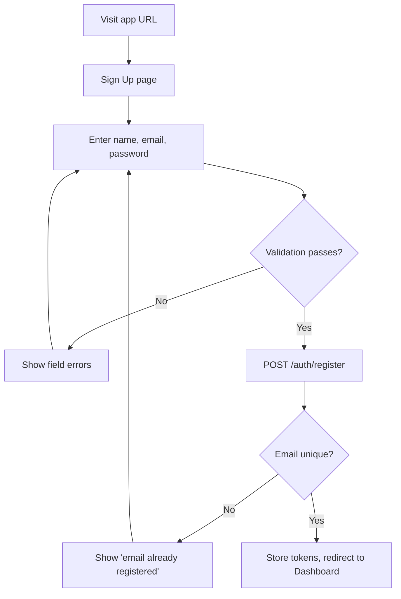

| Step | Screen | API Endpoint |
|------|--------|-------------|
| Enter credentials | Sign Up page | — |
| Submit form | Sign Up page | `POST /auth/register` |
| Success | → Dashboard | — |

---

### 1.2 Login

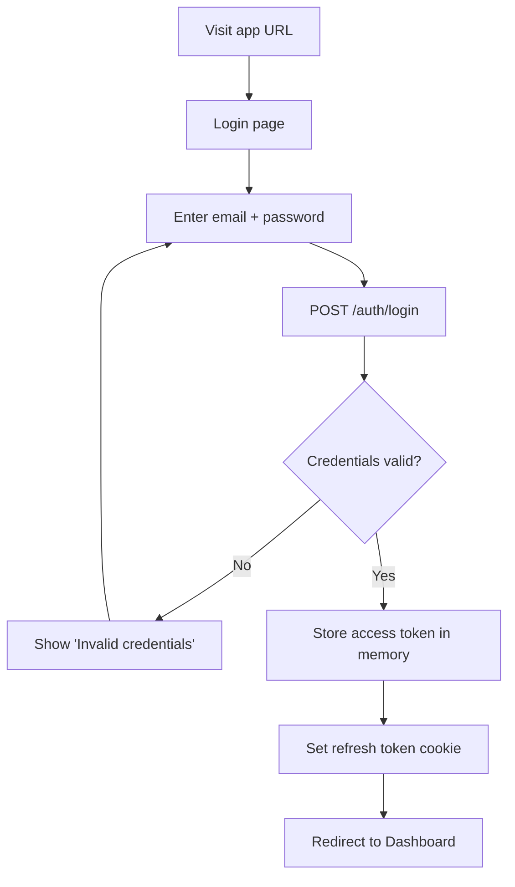

---

### 1.3 Password Reset

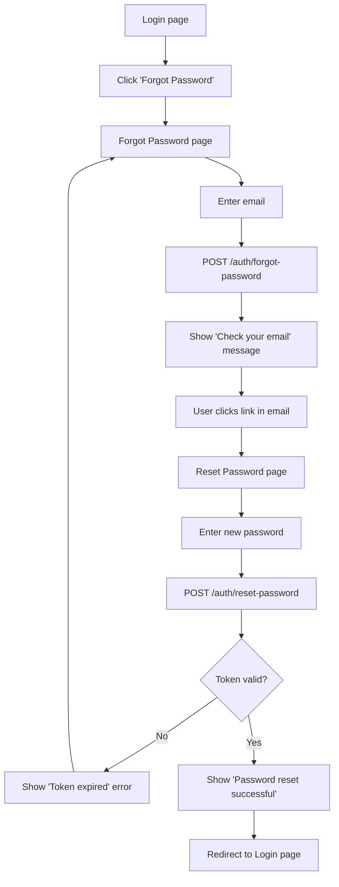

---

## Flow 2: Workspace Management

### 2.1 Create Workspace

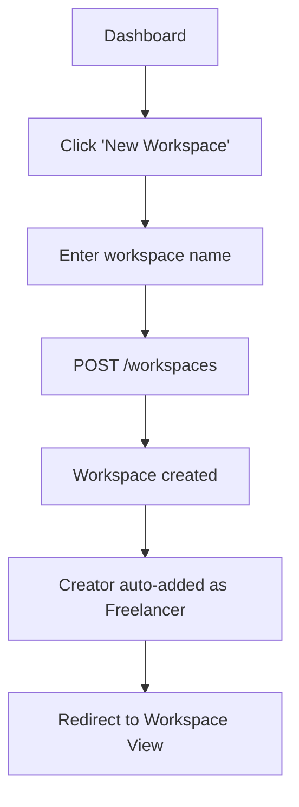

| Step | Screen | API |
|------|--------|-----|
| Click new workspace | Dashboard | — |
| Enter name | Modal / inline form | `POST /workspaces` |
| View workspace | Workspace View | `GET /workspaces/:id` |

---

### 2.2 Invite Member

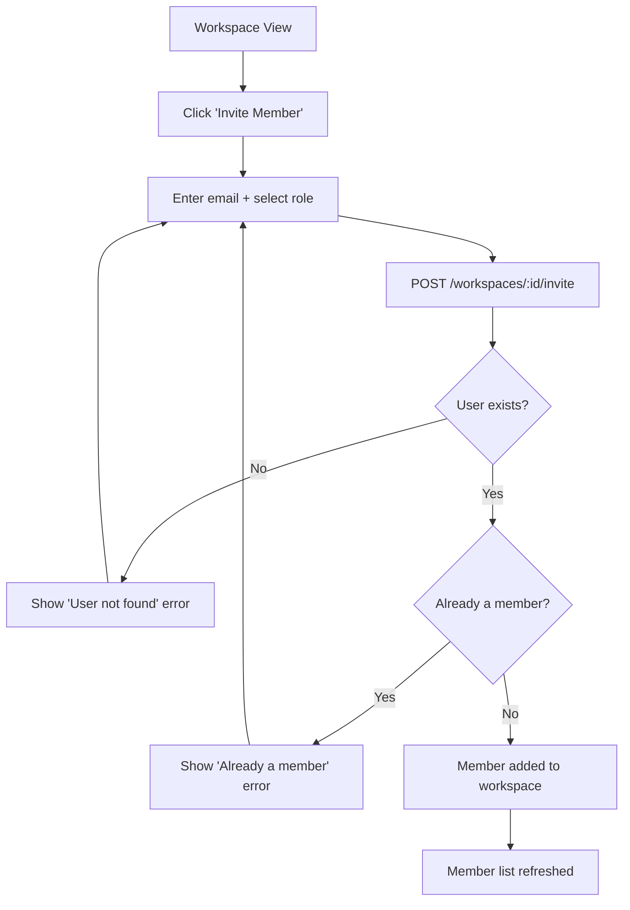

---

### 2.3 Remove Member

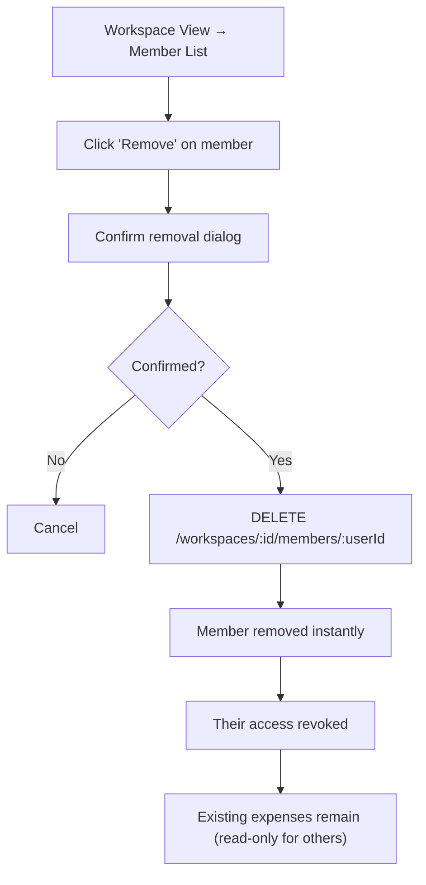

---

## Flow 3: Expense Upload (Critical Path)

This is the primary user journey and must be completable in ≤ 60 seconds.

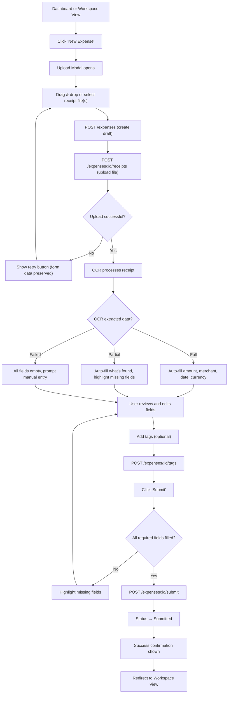

### Screen: Upload Modal

```
┌─────────────────────────────────────────────┐
│  New Expense                           [×]  │
├─────────────────────────────────────────────┤
│                                             │
│  ┌─────────────────────────────────────┐    │
│  │     📁 Drop receipt here            │    │
│  │     or click to browse              │    │
│  │     JPG, PNG, PDF (max 10 MB)       │    │
│  └─────────────────────────────────────┘    │
│                                             │
│  [receipt-preview.jpg]  ← OCR processing... │
│                                             │
│  Amount:    [$] [42.50    ]  Currency: [USD] │
│  Merchant:  [Office Depot              ]    │
│  Date:      [2026-05-20               ]    │
│  Notes:     [Printer supplies          ]    │
│                                             │
│  Tags:  [Office Supplies] [+Add tag]        │
│                                             │
│  [Cancel]                    [Save Draft]   │
│                              [Submit →]     │
└─────────────────────────────────────────────┘
```

### Timing Targets

| Step | Target | Measured By |
|------|--------|------------|
| File upload | ≤ 5 seconds | Time from file select to preview shown |
| OCR processing | ≤ 10 seconds | Time from upload complete to fields populated |
| Total flow (new user) | ≤ 60 seconds | Time from clicking "New Expense" to "Submitted" |

---

## Flow 4: Approval (Critical Path)

### 4.1 Client Approves Expense

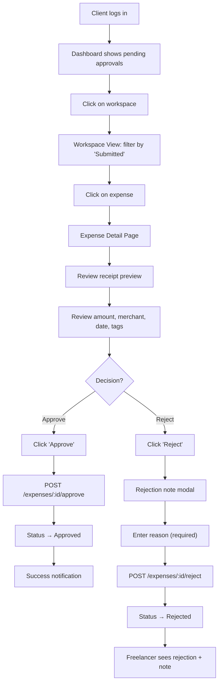

### Screen: Expense Detail (Client View)

```
┌─────────────────────────────────────────────┐
│  ← Back to Workspace    Expense #EXP-0042  │
├──────────────────┬──────────────────────────┤
│                  │                          │
│  [Receipt Image  │  Merchant: Office Depot  │
│   Preview with   │  Amount:   $42.50 USD    │
│   zoom support]  │  Date:     May 20, 2026  │
│                  │  Status:   ● Submitted   │
│                  │  Tags:     Office Supplies│
│                  │                          │
│                  │  Submitted by: Jane Doe  │
│                  │  on May 26, 2026 at 2pm  │
│                  │                          │
│                  │  Notes:                  │
│                  │  "Printer paper and ink"  │
│                  │                          │
├──────────────────┴──────────────────────────┤
│                                             │
│  [❌ Reject]                   [✅ Approve] │
│                                             │
└─────────────────────────────────────────────┘
```

---

### 4.2 Freelancer Resubmits Rejected Expense

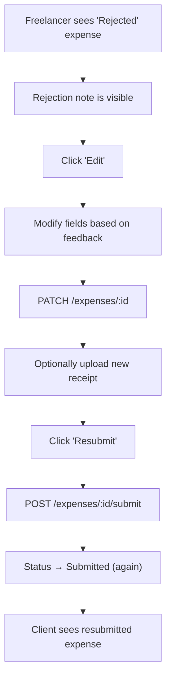

---

## Flow 5: Summary Generation (Critical Path)

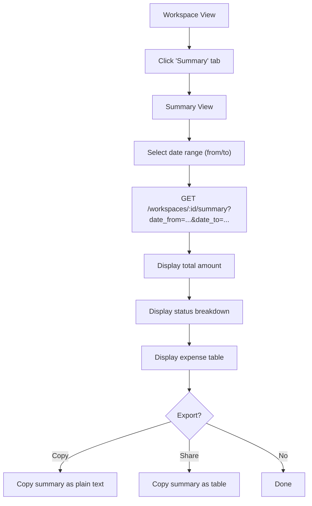

### Screen: Summary View

```
┌─────────────────────────────────────────────┐
│  Reimbursement Summary                      │
│  Workspace: Acme Corp Project               │
├─────────────────────────────────────────────┤
│                                             │
│  Date Range: [May 1, 2026] → [May 31, 2026]│
│                                             │
│  ┌──────────────────────────────────┐       │
│  │  Total: $1,250.00                │       │
│  │  ┌────────┬───────┬──────────┐   │       │
│  │  │Approved│  $600 │ 5 items  │   │       │
│  │  │Pending │  $300 │ 3 items  │   │       │
│  │  │Draft   │  $150 │ 2 items  │   │       │
│  │  │Rejected│   $50 │ 1 item   │   │       │
│  │  │Paid    │  $150 │ 2 items  │   │       │
│  │  └────────┴───────┴──────────┘   │       │
│  └──────────────────────────────────┘       │
│                                             │
│  ┌──────┬──────────┬───────┬────────┬────┐  │
│  │ Date │ Merchant │Amount │ Status │Tags│  │
│  ├──────┼──────────┼───────┼────────┼────┤  │
│  │05/20 │Office D. │$42.50 │Approved│ OS │  │
│  │05/18 │AWS       │$99.00 │Approved│ SW │  │
│  │05/15 │Uber      │$25.00 │Pending │ TR │  │
│  └──────┴──────────┴───────┴────────┴────┘  │
│                                             │
│  [📋 Copy as Text]    [📊 Copy as Table]    │
│                                             │
└─────────────────────────────────────────────┘
```

---

## Flow 6: Dashboard Overview

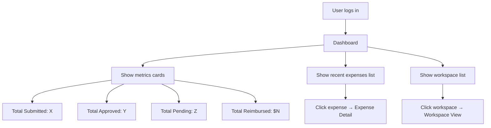

---

## Flow → Screen → API Mapping

| Flow | Screen(s) | API Endpoints |
|------|-----------|--------------|
| Sign Up | Sign Up page | `POST /auth/register` |
| Login | Login page | `POST /auth/login` |
| Password Reset | Forgot Password, Reset Password | `POST /auth/forgot-password`, `POST /auth/reset-password` |
| Dashboard | Dashboard | `GET /workspaces`, aggregate stats |
| Create Workspace | Dashboard (modal) | `POST /workspaces` |
| Invite Member | Workspace View (modal) | `POST /workspaces/:id/invite` |
| Upload Expense | Upload Modal | `POST /expenses`, `POST /expenses/:id/receipts`, `POST /expenses/:id/tags`, `POST /expenses/:id/submit` |
| Edit Expense | Upload Modal / Expense Detail | `PATCH /expenses/:id` |
| Approve Expense | Expense Detail | `POST /expenses/:id/approve` |
| Reject Expense | Expense Detail | `POST /expenses/:id/reject` |
| Resubmit Expense | Expense Detail | `PATCH /expenses/:id`, `POST /expenses/:id/submit` |
| Generate Summary | Summary View | `GET /workspaces/:id/summary` |
| View Expenses | Workspace View | `GET /workspaces/:id/expenses` |
| View Expense Detail | Expense Detail | `GET /expenses/:id` |
